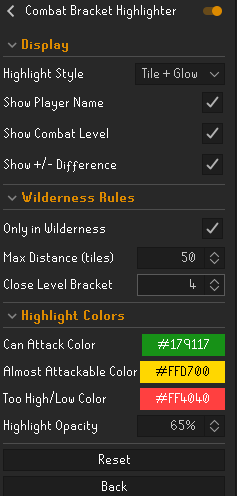
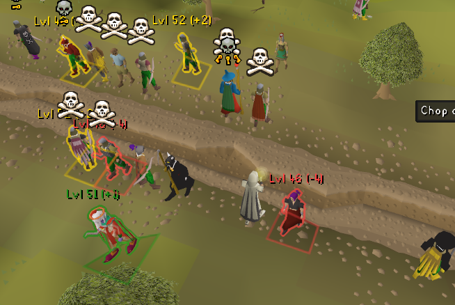

## Combat Bracket Highlighter

A RuneLite plugin that highlights nearby players based on Wilderness combat bracket rules.  
Designed for PvP players who want clear, customizable visuals of who they can or can’t attack.

---

## ✨ Features

- **Highlight Styles**
    - Tile highlight under players
    - Glow outline around player models
    - Tile + Glow combination

- **Configurable Labels**
    - Show/hide player names
    - Show combat levels
    - Show +/- difference from your level

- **Wilderness Rules**
    - Option to only highlight in Wilderness
    - Adjustable max distance (tiles)
    - Configurable "close bracket" threshold

- **Custom Colors**
    - Attackable players
    - Nearly attackable players (1–2 levels outside)
    - Out of reach but close

- **Highlight Opacity (NEW)**
    - Adjustable from **0%–100%** 
    - Applies to **tiles**, **glow outlines**, and **labels**

---

## ⚙️ Configuration

All settings are available in RuneLite’s plugin panel:

- **Highlight Style** → Choose between *Tile*, *Glow*, or *Tile + Glow*
- **Show Player Name** → Toggle displaying player names
- **Show Combat Level** → Toggle displaying combat levels
- **Show +/- Difference** → Toggle level difference from your level
- **Highlight Opacity** → Fade highlights between 0% (invisible) and 100% (solid)
- **Only in Wilderness** → Restrict highlighting to Wilderness only
- **Max Distance (tiles)** → Highlight players within a set distance (0 = unlimited)
- **Close Bracket** → Highlight players within X levels of being attackable
- **Custom Colors** for Attackable, Nearly Attackable, and Out of Reach players

---

## 📷 Screenshots

